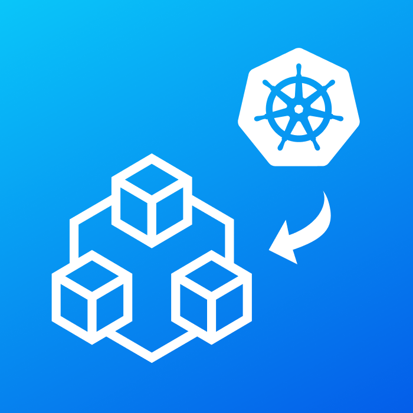

# OpsLevel Helm Charts

[](https://artifacthub.io/packages/search?repo=opslevel) 


Official Helm charts for OpsLevel products. Currently supported:

- [Kubernetes OpsLevel Sync](https://github.com/OpsLevel/kubectl-opslevel) (opslevel/kubectl-opslevel)

## How to use OpsLevel Helm repository

You need to add this repository to your Helm repositories:

```
helm repo add opslevel https://opslevel.github.com/helm-charts
helm repo update
```
