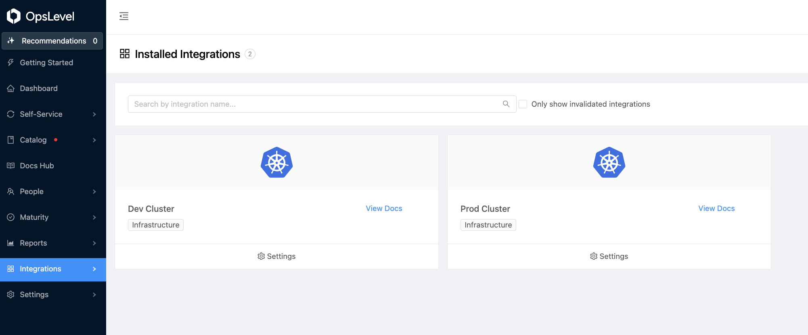

OpsLevel Agent
---

This chart installs the [opslevel-agent]() for your kubernetes clusters

## Prerequisites

- Make sure you have the [OpsLevel Helm chart](https://github.com/OpsLevel/helm-charts) repository added.
- Make sure you have the ["kubernetes integration"](https://app.opslevel.com/integrations/new?name=kubernetes) installed in your opslevel account 

## Values.yaml

The bare minimum values file look like this

```yaml
secret:
  data:
    OPSLEVEL_API_TOKEN: "XXXXX"
```

```bash
helm install opslevel-agent opslevel/opslevel-agent -f values.yaml
```

## Multiple Clusters

If you intend to deploy the agent to multiple clusters you may want to create a unique 
integration tile in your OpsLevel account for each cluster so that you know which cluster the recommendations are coming from.
If you do this you'll need to specify the integration's alias in the values file you'll want the agent to submit for like this:



```yaml
agent:
  integration: "prod-cluster"
```

## Resource Targeting

By default the agent will target the following resources:

- v1/Service
- apps/v1/Deployment
- apps/v1/StatefulSet
- apps/v1/DaemonSet
- batch/v1/CronJob

but if you want other resource types to make suggestions you can add configuration so long as the
resource types show up when you use `kubectl api-resources --verbs="get,list"`.

The following restricts the agent to only syncronize Service and APIService resources:

```yaml
configmap:
  data:
    config.yaml: |
      selectors:
      - apiVersion: "v1"
        kind: Service
      - apiVersion: "apiregistration.k8s.io/v1"
        kind: APIService
```